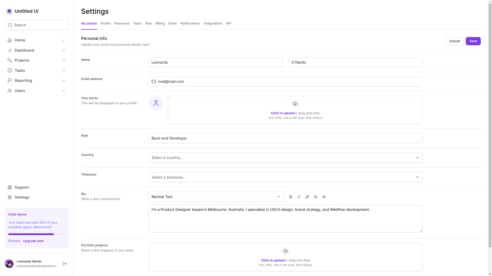
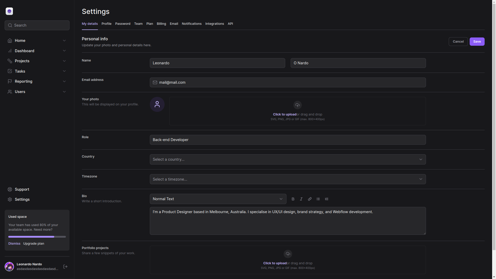
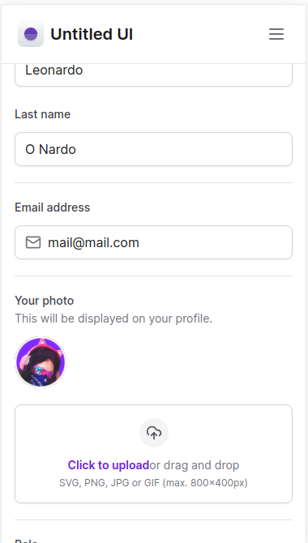

## 💻 About

A simple project made in next, with the main focus on tailwind to study techonogies that will be mentioned below
___

## 🎨 Layout





___

## 🛠 Technologies

The following technologies were used in the creation of this project:

- [TailwindCSS](https://tailwindcss.com/)
- [NextJS - 13+](https://nextjs.org/)
- [ReactJs](https://reactjs.org)
- [Radix UI](https://www.radix-ui.com/)
- [Framer Motion](https://www.framer.com/motion/)

___

## 🚀 How to use

Clone the project to your local machine

```bash
$ git clone https://github.com/leo-the-nardo/nextjs-tailwind
```

___

#### 🚧 Running the Project

```bash

# Navigate to the directory
$ cd nextjs-tailwind

# Install the required dependencies
$ npm install

# Start front-end
$ npm run dev

# Access the application through the following address:

  http://localhost:3000/
```
